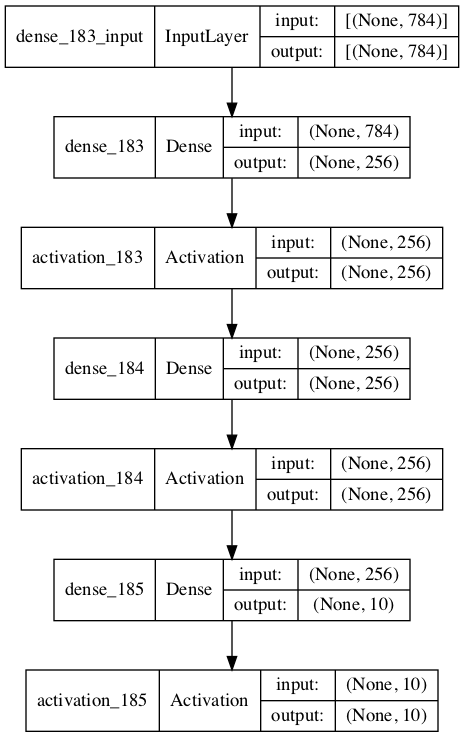

# MLP_GA 

使用遗传算法优化的多层多感知器超参数

# MLP_VGG_CIFAR
使用VGG的多层多感知器超参数

# result example
```
....
........ 省略

 -- 9 代 --
mate
mate
optimizer is Adam
 load mnist data
  build mlp model

        optimizer:	<keras.optimizers.Adam object at 0x7fa3475960b8>
        dense1:	256
        dense2:	32
        drop1:	0.29334818588837985
        drop2:	0.31627557353342245
        activation:	sigmoid
        batch_size:\32
        
_________________________________________________________________
Layer (type)                 Output Shape              Param #   
=================================================================
dense_87 (Dense)             (None, 256)               200960    
_________________________________________________________________
activation_85 (Activation)   (None, 256)               0         
_________________________________________________________________
dropout_58 (Dropout)         (None, 256)               0         
_________________________________________________________________
dense_88 (Dense)             (None, 32)                8224      
_________________________________________________________________
activation_86 (Activation)   (None, 32)                0         
_________________________________________________________________
dropout_59 (Dropout)         (None, 32)                0         
_________________________________________________________________
dense_89 (Dense)             (None, 10)                330       
_________________________________________________________________
activation_87 (Activation)   (None, 10)                0         
=================================================================
Total params: 209,514
Trainable params: 209,514
Non-trainable params: 0

....
........ 
  评估4人
  Min 0.07774280903284671
  Max 0.09001250675814226
  Avg 0.08313211445707129
  Std 0.004174518287204314
-- 迭代结束 -- 
 best indival [256, 32, 0.29334818588837985, 0.31627557353342245, 32, 'sigmoid', 'Adam'] (0.07774280903284671,) 
```

# code 

代码说明

- mlp_ga.py
    - 使用GA（遗传算法）推导MLP的最优模型
- mlp.py
    - 从 MLP 类 model.py 调用
- mlp_vgg_cifar.py
    - 使用 VGG 的最优模型

# Usage

1run script on Python3
```
python3 mlp_ga.py
```

# example model



# Requirement

- Software
    - python3.6.3
    - tensorflow==1.7.0
    - keras==2.1.5
    - numpy==1.14.0
    - matplotlib==2.2.2
    - deap==1.2.2
