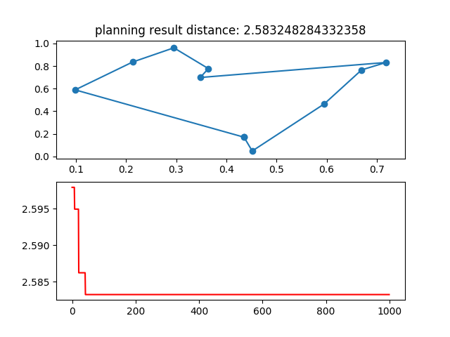
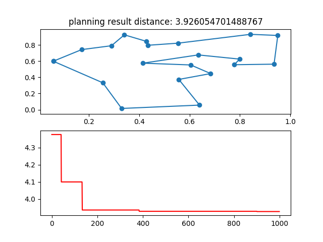

# TSPSolveByGA

### Introduce
Use GA to solve TSP problems

### Environment
* `Win 10 or Mac`
* `Python 3`

### Package
Enter the project directory and run the following command
```shell
pip3 install -r requirement.txt
```

### GA

#### Usage
Enter the current src folder, and then enter the following command
```
python tsp_solved_by_genetic_algorithm.py
```
#### Result
*Problem1:* `TSP - ch10`
*Problem2:* `TSP - ch20`
*Problem3:* `TSP - ch30`
*Problem4:* `TSP - ch10 and have srat point and end point`
*Problem5:* `TSP - ch20 and have srat point and end point`
*Problem6:* `TSP - ch30 and have srat point and end point`


#### My Solution
Problem1:

Problem2:


### 注意
-tsp_solved_by_genetic_algorithm.py     This program mainly uses ga algorithm to solve common tsp problems
-tsp_with_restrictions_genetic_algorithm.py     This program mainly uses the ga algorithm to solve the common tsp problem of the designated starting location city point
-atsp_solved_by_genetic_algorithm.py    This program mainly uses ga algorithm to solve atsp problems
-tsptw_solved_by_ga.py  This program mainly uses ga algorithm to solve tsptw problems
-largest_tsp_solved_by_cluster.py   This program mainly uses clustering algorithm to solve the large-scale data tsp problem