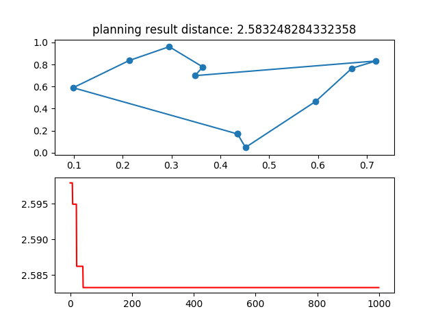
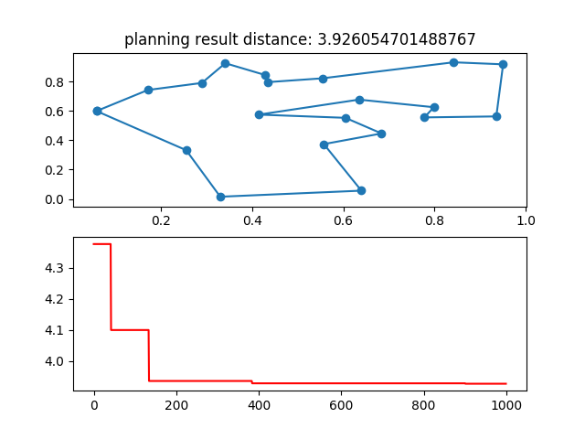

# TSPSolveByGA

### 介绍
使用GA解决TSP问题

### Environment
* `Win 10 or Mac`
* `Python 3`

### Package
进入该项目目录下运行以下命令
```shell
pip3 install -r requirement.txt
```

### GA

#### Usage
进入当前src文件夹，然后输入以下命令
```
python tsp_solved_by_genetic_algorithm.py
```
#### Result
*Problem1:* `TSP - ch10`
*Problem2:* `TSP - ch20`
*Problem3:* `TSP - ch30`
*Problem4:* `TSP - ch10 and have srat point and end point`
*Problem5:* `TSP - ch20 and have srat point and end point`
*Problem6:* `TSP - ch30 and have srat point and end point`


#### My Solution
Problem1:

Problem2:


### 注意
- tsp_solved_by_genetic_algorithm.py 该程序主要使用ga算法解决常见的tsp问题
- tsp_with_restrictions_genetic_algorithm.py 该程序主要使用ga算法解决常见的指定起始位置城市点的tsp问题
- atsp_solved_by_genetic_algorithm.py 该程序主要使用ga算法解决atsp问题
- tsptw_solved_by_ga.py 该程序主要使用ga算法解决tsptw问题
- largest_tsp_solved_by_cluster.py 该程序主要使用聚类算法解决large-scale data tsp问题